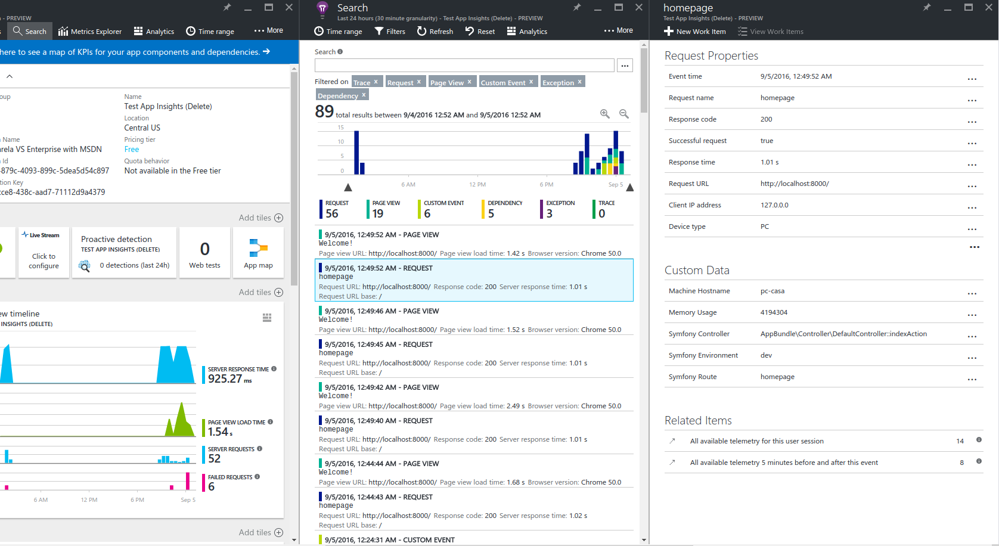

# BerriartAPMBundle

Seamless integration between APM (Application Performance Monitoring) services and Symfony projects.

**Important Note**: This Bundle is still in BETA stage. Breaking changes to the API can ocasionally be
done until v1.0.0 is released. Use it with caution.

## Summary

The BerriartAPMBundle integrates Symfony with APM services, it sends telemetry of various kinds
(event, request, exception, etc.) to one or multiple APM services, to keep your application available,
performing and succeeding.

APM services already included:

- [Visual Studio Application Insights](https://azure.microsoft.com/en-us/services/application-insights/)

Coming soon:

- [New Relic](https://newrelic.com/)

Features include:

- **Request monitoring**: Every request is tracked including: status code, url, duration, memory usage,
controller name, route name and symfony environment name.
- **Exception tracking**: Every Symfony exception is tracked.
- **Additional Command Line Tools**: A command for sending messages to the APM services. For example, you can use it
for sending deployment notifications to your monitoring system.
- **Multi APM support**: you can use as many APM providers as you want. Usually only one is used but is usefull
for migrations. If you APM provider is not supported by this bundle you can create your own and contribute to the project
or make us a suggestion.
- **APM API Wrapper**: you will be able to use a unique interface for every integrated APM service.

## Documentation

The source of the documentation is stored in the `Resources/doc/` folder in this bundle:

- [Installation](Resources/doc/installation.md).
- [Command Line Tools](Resources/doc/commands.md).

## Installation

All the installation instructions are located in the [documentation folder](Resources/doc/installation.md).

## License

This bundle is available under the [MIT License](LICENSE).

## Reporting an issue or a feature request and contributing

See the [contributing guide](CONTRIBUTING.md).

# About

BerriartAPMBundle is a [Berriart](http://www.berriart.com) initiative.
